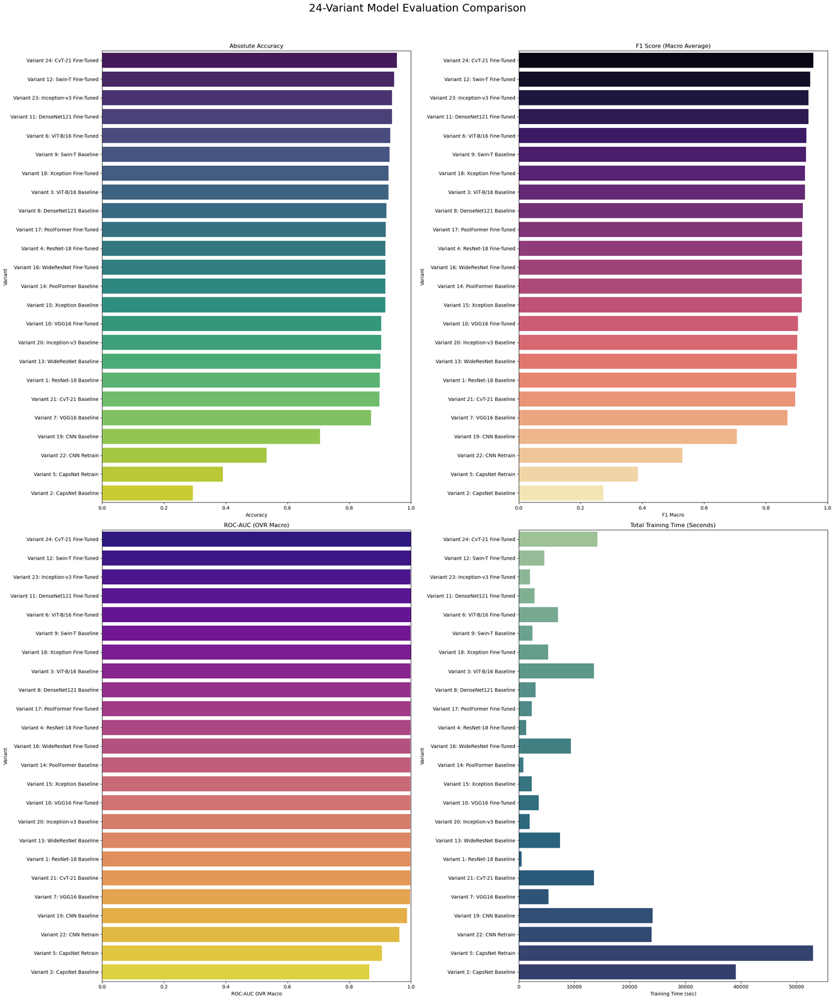
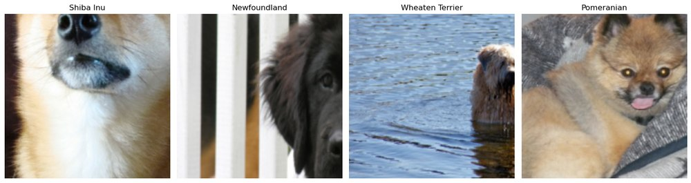

# Transfer-Learning Benchmark — Oxford-IIIT Pets (24 variants, 12 backbones)

[](https://colab.research.google.com/github/AsserGharib1/PetsClassificationML/blob/main/oxford_pets_transfer_learning_benchmark.ipynb)
[](https://nbviewer.org/github/AsserGharib1/PetsClassificationML/blob/main/oxford_pets_transfer_learning_benchmark.ipynb)

> **Viewing tip:** GitHub truncates the inline preview of large notebooks (this one preserves all training outputs). Use the **nbviewer** badge above to read it fully rendered in the browser, or **Colab** to open it interactively.


Systematic benchmark of CNN, capsule, and transformer image classifiers on the Oxford-IIIT Pet dataset (7,349 images, 37 breeds), comparing training from scratch against fine-tuning.

## Highlights

- **24 experiment variants across 12 backbones**: ResNet, DenseNet, Inception, CapsNet, ViT, Swin, CvT, and more (via `torchvision`, `timm`, and `transformers`).
- Best model: **fine-tuned CvT-21 at 95.5% accuracy, 0.9994 ROC-AUC**.
- Quantified transfer-learning gains: **~95% fine-tuned vs ~70% from scratch** under identical budgets.
- Reproducible setup: fixed seeds, unified 70/15/15 split, shared training/evaluation loops, per-model parameter summaries, and full evaluation plots (confusion matrices, learning curves, ROC).

## Benchmark results

Final comparison across all 24 variants:



Sample training batch:



## Repository contents

- `oxford_pets_transfer_learning_benchmark.ipynb` — the complete benchmark with all preserved outputs.

## Running

```bash
pip install -r requirements.txt
```

The notebook downloads the Oxford-IIIT Pet dataset, builds the split once, and reuses it across all 24 variants for a fair comparison.
